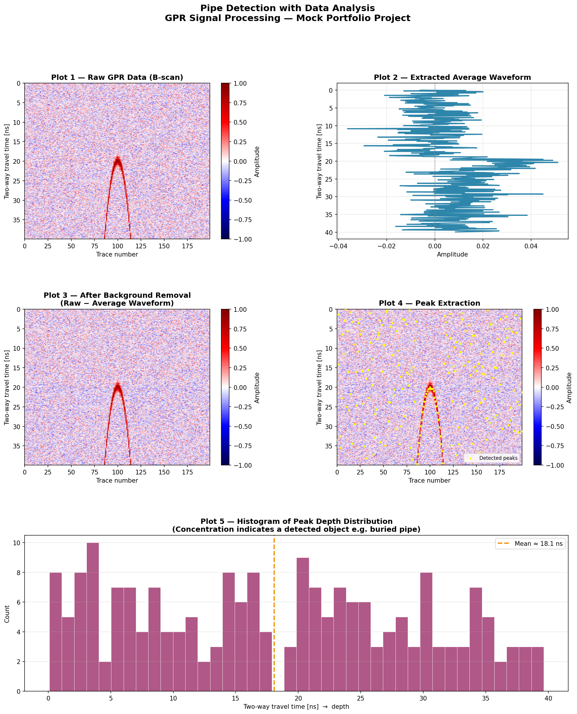

# Pipe Detection with Data Analysis
### GPR Signal Processing — Mock Portfolio Project

---

## Overview

This project demonstrates a signal processing pipeline for detecting underground structures (e.g. buried pipes) using **Ground Penetrating Radar (GPR)** raw data.

GPR is a non-destructive survey technique that emits electromagnetic pulses into the ground and records the reflected signals. When a signal encounters a buried object such as a pipe, it produces a characteristic **hyperbolic reflection pattern** in the 2-D scan image (B-scan). By applying signal processing techniques, these patterns can be identified and their depth estimated.

> **Note:** This is a mock/demonstration project based on synthetic data. It reflects the general approach and workflow used in real-world GPR data analysis. Proprietary datasets and site-specific parameters have been omitted.

---

## Pipeline

```
Read CSV Data
     │
     ▼
Trim to Desired Time Range
     │
     ▼
Extract Average Waveform (background estimation)
     │
     ▼
Noise Reduction — Subtract Average Waveform from Raw Data
     │
     ▼
Peak Extraction — Identify dominant reflections per trace
     │
     ▼
Histogram Analysis — Visualise peak depth distribution
```

---

## Signal Processing Logic

### Background Removal
The average waveform is computed by averaging all horizontal traces across the B-scan. This captures the consistent background response of the soil and system noise. Subtracting it from each trace isolates anomalous reflections caused by buried objects.

### Detection Interpretation
- **Random stripe pattern (ランダム的な縞模様):** No significant structure detected. The pattern is consistent with soil noise.
- **Organised/curved stripe pattern (縞模様):** Indicates a subsurface object. A hyperbolic arch is characteristic of a pipe or cylindrical structure.

### Peak Extraction & Histogram
The dominant peak amplitude per trace is extracted using `scipy.signal.find_peaks`. Plotting these peak depths as a histogram reveals whether reflections are **randomly distributed** (no object) or **concentrated at a specific depth** (buried object detected).

---

## Output Plots

| Plot | Description |
|------|-------------|
| **Plot 1** | Raw GPR data — 2-D B-scan heatmap |
| **Plot 2** | Extracted average waveform (background signal) |
| **Plot 3** | Noise-reduced B-scan after background subtraction |
| **Plot 4** | Peak extraction overlay on the cleaned B-scan |
| **Plot 5** | Histogram of peak depth distribution |



---

## Requirements

```
numpy
pandas
matplotlib
scipy
```

Install with:

```bash
pip install numpy pandas matplotlib scipy
```

---

## Usage

```bash
python pipe_detection.py
```

By default, the script runs in **demo mode** using synthetic GPR data. To use real data, pass the filepath to `load_data()`:

```python
df_raw = load_data(filepath="your_data.csv")
```

The CSV should have:
- **Rows:** time samples (two-way travel time in ns)
- **Columns:** trace number (horizontal scan position)

---

## Background & Motivation

This project is inspired by work I carried out during my tenure at **NTT Research** in Japan, where I was involved in R&D projects requiring sensor data acquisition, signal processing, and data visualisation using Python.

The core workflow — raw data ingestion, signal cleaning, feature extraction, and visualisation — mirrors the kind of pipeline I built professionally, applied here to GPR as a publicly explainable domain.

---

## Skills Demonstrated

- Python data pipeline design (ETL-style: ingest → process → output)
- NumPy array operations and signal manipulation
- `scipy.signal` for peak detection
- `matplotlib` for multi-panel scientific visualisation
- Pandas for tabular data handling

---

## Future Improvements

- Replace synthetic data generator with a real CSV reader and configurable parameters
- Add automated pipe depth estimation from peak clustering
- Migrate data processing to **PySpark** for large-scale multi-file GPR datasets
- Build a simple web dashboard using **Flask or FastAPI** to upload and visualise GPR scans interactively
- Explore cloud deployment on **AWS S3 + Lambda** for batch GPR file processing

---

## Disclaimer

This is a mock project created for portfolio purposes. All data is synthetically generated. No proprietary or confidential information from any employer or client is included.
